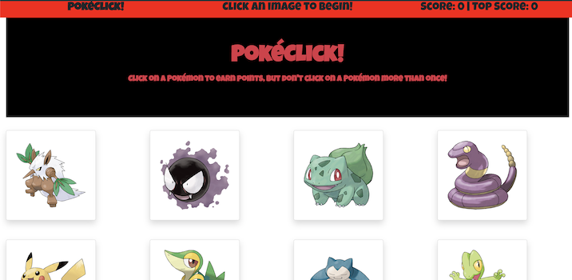

# clicky-game
A memory game created as an exercise to learn React.

# App Organization
This app's structure is entirely front end and follows the basic organization the "create-react-app" produces.
## **Public:** 
These include the index file that is directly displayed by the browser and the robots.txt file, which determines which files web robots can access.
## **Source:** 
These are the React files that drive the experience. They include: 
* index.js: This is where React is actually rendering the page.
* Skeleton.js: This component provides the general structure of the page and holds global functions and variables the app needs.
* Navbar.js: This contains the header bar seen at the top of the page.
* Jumbo.js: This contains a bootstrap jumbotron containing the apps title and instructions.
* Gameboard.js: This component defines the grid where we display the Pok&#233;mon pictures.
* Gamepic.js: This component holds one Pok&#233;mon image. Clicking on an image will either give the user a point, or reset the score if they've clicked that Pok&#233;mon before.
* Footer.js: This contains the simple footer seen at the bottom of the page.

# How to use the app
1. Go to https://woaky1.github.io/clicky_game/.
2. Click on a picture of a Pok&#233;mon.

3. If this is your first time clicking on that Pok&#233;mon, you earn a point and the gameboard shuffles the Pok&#233;mon images. The game keeps track of your highest score.

4. Be careful, though. If you click on a Pok&#233;mon you've already clicked on, your score goes back to zero, the gameboard shuffles, and the game starts over.

# Technology used
This app was built primarily with Node and React. Bootstrap was used to help with page layout. The gh-pages node module was used to help to deploy the app to Github pages.

# About Me
I'm a full stack web developer. I created this game to help me get familiar with using React. My son helped me pick Pok&#233;mon to use in the game and did playtesting.